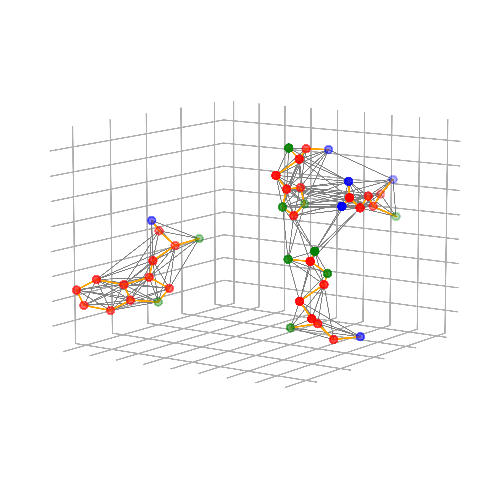

# GraphSite   
GraphSite is a deep learning-based software to classify ligand-binding sites on proteins. It is implemented with Pytorch and Pytorch-geometric. During training, the binding sites are transformed on-the-fly to graphs that contain both spacial and chemical features. A customized graph neural network (GNN) classifier is then trained on the graph representations of the binding pockets.   
The following figure illustrates the convertion from a binding pocket (A) to a graph (B):

<p align="center">

</p>

If you use this repo in your work please cite our paper :)
```
Currently under peer review
```


## Dataset
The dataset consists of 21,125 binding pockets which are grouped into 14 classes. The details of the classes are described [here](docs/data.md). There are three files needed for training:
1. ```clusters.yaml```: contains information about the initial clustering information of the binding sites. Multiple clusters will be merged into one class before training. 
2. ```dataset.tar.gz```: contains all binding site data in this project.
3. ```pops.tar.gz```: contains popsa files describing the accessable surface area property which is used as a node feature.

## Usage
### Dependency
There are several dependencies for the train and inference Python script:
1. Pytorch
2. Pytroch-gemetric
3. Numpy
4. PyYAML
5. BioPandas
6. Pandas
7. Scikit-learn
8. Matplotlib
9. SciPy

### Training
The configuration of training is in the ```train_classifier.yaml```. To use the default hyper-paramters for training, the user only have to make the following modifications:
1. set ```cluster_file_dir``` to the path of ```clusters.yaml``` you downloaded.
2. set ```pocket_dir``` to the path of uncompressed ```dataset.tar.gz``` you downloaded.
3. set ```pop_dir``` to the path of uncompressed ```pops.tar.gz``` you downloaded.
4. set ```trained_model_dir```: to the directory where you want the trained model to be saved.
5. set ```loss_dir``` and ```confusion_matrix_dir``` to the directory where you want to save other training results.

After the training confiruations are set, simply
```
python train_classifier.py
```

### Inference
