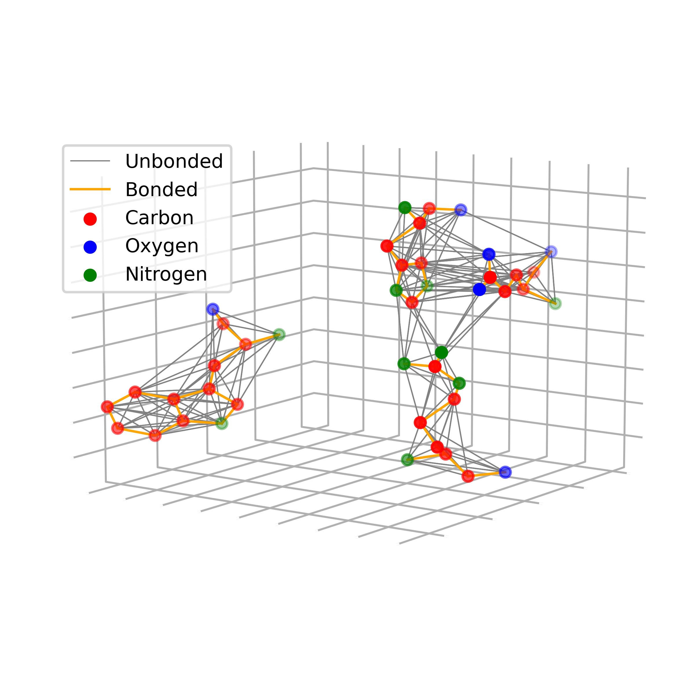

# MoNet   
Ligand-binding sites are transformed to graphs for deep learning.   

   

## Dataset
The dataset has 51677 pockets clustered into 1301 clusters.    

|  | small (1-29) | middle (30-199) | large (200-999)| super-large (1000-)|   
| --- | --- | --- | --- | --- |      
| number of classes | 1060 | 193 | 42 | 6 |   
| number of pockets | 6951 | 11457 | 18580 | 11457 |   

The statistics of the dataset(mean diameter is inf because there are unconnected graphs):   

|  | number of nodes | number of edges | density | diameter | average degree |   
| --- | ---             | ---             | ---     | ---      | ---            |   
| mean | 142.77 | 765.83 | 0.082 | inf | 10.64 |   
| median | 137 | 730 | 0.078 | 10 | 10.64 |   

Manually identified clusters:   

| cluster | description |   
| --- | --- |
| 0 | ATP and its related ligand like ADP, ANP|
| 1| glycol and ether groups who are also structurally closely related |
| 2 | heme | 
| 3 | glucopyranose and fructose ( carbohydrate types of ligand) |
| 4 | benzene ring containing ligand group such as benzaldehyde, benzoic acid, phenoxyphenylboronic acids etc |
| 5 | dihydroxyethyl ether, glycol |
| 6 | chlorophyll |
| 7 | lipid containing ligands such as phosphocholine, bromododecanol, tetradecylpropanedioic acids etc |
| 8 | glucopyranose ( carbohydrate types of ligand)
| 9 | UMP, thymidine monophosphate which are ATP related ligands |
| 10 | essential amino acids like Norvaline, lysine, arginine etc | 
| 11 | ether and glycol |
| 12 | NAD which is the metabolites of ATP | 
| 13 | carbohydrates like alpha-D galactopyranose, manopyranose |
| 14 | glucopyranose, pentadiol, trifluroactic acid, phenyllactate, which is a combination of alcohol, carbohydrates and acid groups. The predominant group is pentanediol, propane 1,3 diols which are similar to glycols |
| 15 | S-adenosyl-L-homocysteine |
| 16 | citric acid and its derivatives |
| 17 | coenzymeA |
| 18 | pyridoxal phosphate group |
| 19 | lipid and fatty acids group of ligands like oleic acid, palmitic acid, hexaenoic acid |
| 20 | methylbenzamide, pentanamide etc which are derivative of benzoic acid (benzene ring containing group) |
| 21 | (2R)-2,3-dihydroxy propyl (9Z)-octadec-9-enoate, oleic acid etc . They are fatty acids and lipid groups |
| 22 | hexaethylene glycol, tetraethylene glycol etc. which are the group of glycols |
| 23 | 2-(2,3-DIHYDROXY-BENZOYLAMINO)-3-HYDROXY-PROPIONIC ACID, Benzoic acid etc which are the benzene ring containing group |
| 24 | Flavin Mononucleotide (FMN). FMN usually take part in electron transport mechanism like coenzymeA and ATP. |
| 25 | Adenosine, ADP, Azamethionine-5'-deoxyadenosine, Beta-D-erythrofuranosyl Adenosine, etc. All are ATP related ligands |
| 26 | group of 2-N-morpholino ethanesulfonic acid , which contains a morpholine ring |
| 27 | glucopyranose |
| 28 | Tartaric acid, tetraglycine phosphinate, 1,3 dihydroxyacetone phosphate |
| 29 | glycerol-1-phosphate, dihydroxyacetone phosphate, glycerolaldehyde 3 phosphate etc. |
<!--| 30 | octyl beta-D-glucopyranose, 2 aceto amido-2-deoxy beta-D glucopyranose |-->

Current grouping of classes:   

| class | clusters | label |
| --- | --- | --- |
| 0 | 0, 9, 12, 25 | ATP |
| 1 | 2 | heme |
| 2 | 3, 8, 13, 27 | carbonhydrate |
| 3 | 4 | benzene ring |
| 4 | 6 | chlorophyll |   
| 5 | 7, 19, 21 | lipid |
| 6 | 10, 16, 28 | essential amino/citric acids/ tartaric acid |   
| 7 | 15 | S-adenosyl-L-homocysteine |
| 8 | 17 | coenzymeA |
| 9 | 18 | pyridoxal phosphate |   
| 10 | 20, 23 | benzoic acid |
| 11 | 24 | flavin mononucleotide |
| 12 | 26 | morpholine ring |
| 13 | 29 | phosphate |   

<!--| 1 | 1, 5, 11, 22 | glycol and ether |-->
<!--| 14 | 28 | Tartaric acid |-->   
<!--| 15 | 27, 30 | glucopyranose |-->

