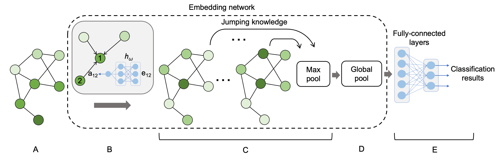

# Graphsite-classifier   
Graphsite-classifier is a deep graph neural network to classify ligand-binding sites on proteins. It is implemented with Pytorch and Pytorch-geometric. During training, the binding sites are transformed on-the-fly to graphs that contain both spacial and chemical features. A customized graph neural network (GNN) classifier is then trained on the graph representations of the binding pockets. The following figure illustrates the application pipeline:
<p align="center">

</p>

For more details, please reference our paper. If you find this repo useful in your work please cite our paper :)
```
Currently under peer review
```

## Dataset
The dataset consists of 21,125 binding pockets which are grouped into 14 classes. The details of the classes are described [here](docs/data.md). There are three files needed for training:
1. ```clusters.yaml```: contains information about the initial clustering information of the binding sites. Multiple clusters will be merged into one class before training. 
2. ```pocket-dataset.tar.gz```: contains all binding site data in this project.
3. ```pops-dataset.tar.gz```: contains information of node feature contact surface area.    

If you want to generate your own data, the procedures and scripts to create the ```.mol2```, ```.pops```, and ```.profile``` files can be seen [here](docs/data_curation/readme.md). 

## Usage
### Dependency
There are several dependencies for the train and inference Python script:
1. Pytorch
2. Pytroch-gemetric
3. Numpy
4. PyYAML
5. BioPandas
6. Pandas
7. Scikit-learn
8. Matplotlib
9. SciPy

### Training
Everything of the graph neural network implementation is at ```./gnn```. The configuration of training is in the ```./gnn/train_classifier.yaml```. To use the default architecture and hyperparamters for training, which we recommend, the user only have to make the following modifications:
1. set ```cluster_file_dir``` to the path of ```clusters.yaml``` you downloaded.
2. set ```pocket_dir``` to the path of uncompressed ```dataset.tar.gz``` you downloaded.
3. set ```pop_dir``` to the path of uncompressed ```pops.tar.gz``` you downloaded.
4. set ```trained_model_dir```: to the directory where you want the trained model to be saved.
5. set ```loss_dir``` and ```confusion_matrix_dir``` to the directory where you want to save other training results.
If you want to try to play with the model, feel free to tune the hyperparameters and try other models.   

After the training confiruations are set, simply
``` 
cd ./gnn
python train_classifier.py
```

### Inference
The inference script requires 3 input arguments:
1. ```unseen_data_dir```: directory of unseen data. For each pocket, there should be 3 associated files: ```.mol2```, ```.pops```, and ```.profile```. For example, a pocket on protein ```6af2A``` needs the following 3 files:
```
6af2A.pops
6af2A.profile
6ag5A00.mol2
```
2. ```unseen_data_classes```: a yaml file containing 14 lists which represent the classes of data. If there is no data in a class, it should correspond to an empty list. See ```unseen-pocket-lists.yaml``` as an example.
3. ```trained_model```: the path to the trained model.
After the inference data are prepared, run the following script to test the model:
```
python inference.py -unseen_data_dir ../unseen-data/unseen_pdb/ -unseen_data_classes ../unseen-data/unseen-pocket-list_new.yaml -trained_model ../trained_models/trained_classifier_model_63.pt
```
